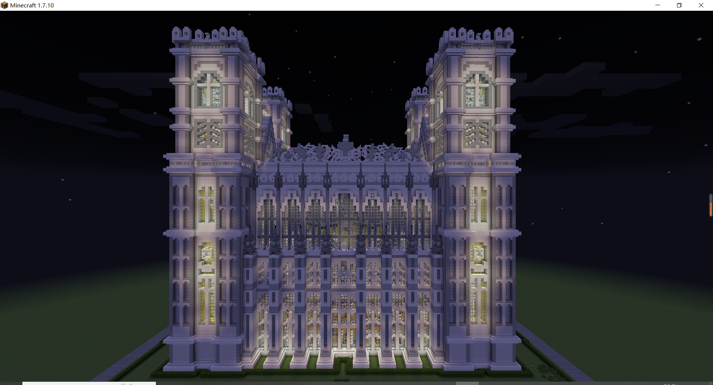
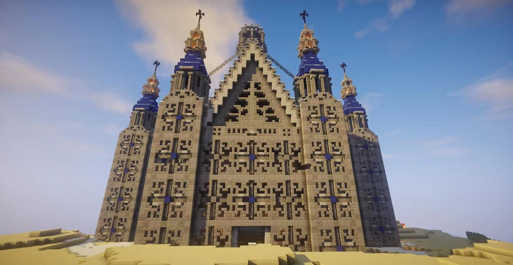
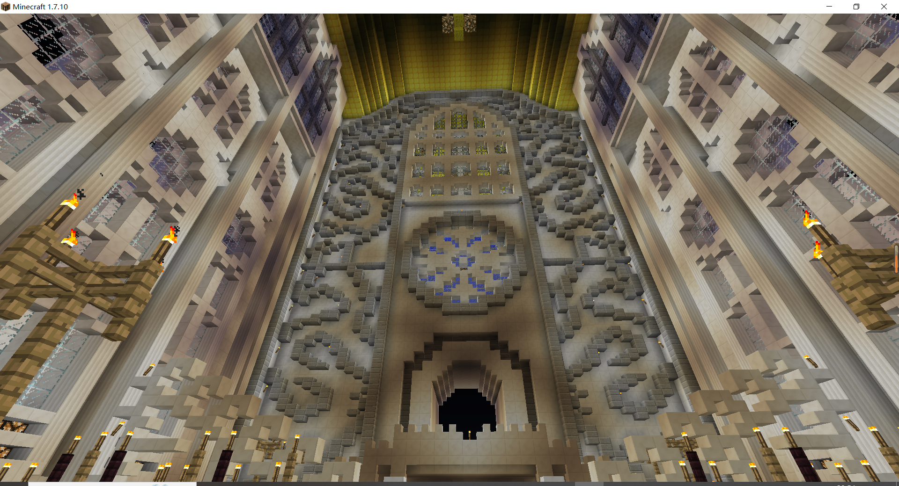

## About Me

I am a compassionate person who cherishes my family and friends. I enjoy playing video games and watching TV shows on platforms like Netflix and others. The American pop culture has deeply influenced me.

## Dream

I have a great passion for architecture, and my childhood dream was to become an architect. My childhood dream was inspired by the game Minecraft, where I designed buildings such as medieval castles and Gothic churches. 

## Fa
