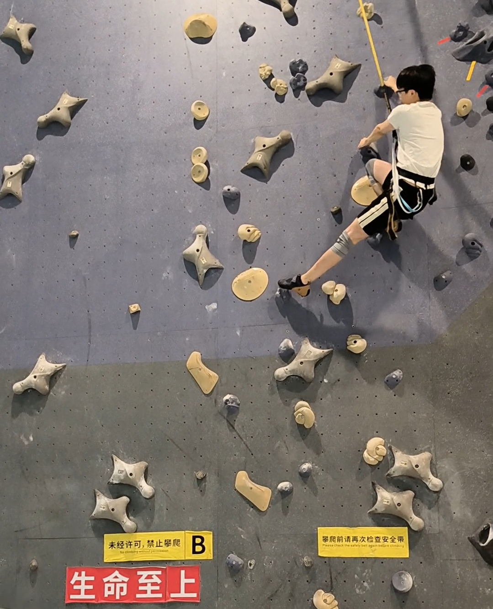

<link rel="stylesheet" href="https://cdn.jsdelivr.net/npm/aplayer@1.7.0/dist/APlayer.min.css">

## About Me

I am a compassionate person who cherishes my family and friends.

## Hobby

I love rock climbing and working out in the gym. I have joined the rock climbing club in HKUST(GZ). I climb regularly!

    

        
    

    

       Me climbing on the wall
  	

Aside from sports, I have always had a passion for architecture design from a young age. I love playing the game ***Minecraft***, where I would design and build everything from medieval castles to Gothic churches. 

 

    

        <iframe style="position: absolute; width: 100%; height: 100%; left: 0; top: 0;" src="../plugs/photo_album2/index.html" frameborder="0" scrolling="no" id="myIframe"></iframe>
    

    

        My crafted designs in Minecraft
    

  

Displayed above are my architectural creations from Minecraft, all of which I built brick by brick at the age of 14. Sadly, due to the passage of time, most of my Minecraft game files have been lost, and these are all the architectural works I could find.

## Campus Life

I had been living in a small town until I came to Shenzhen University (SZU), where I spent four precious years. This international city, Shenzhen, has made a great difference to me. Here, I met a group of lovely friends and professors who have been so kind to me. Click [HERE](https://guohaodai.github.io/szu_life_imgs/){: .btn--code} to see how chill I was! 

SZU has enabled me to construct my own methodology for facing the world and has given me clarity on what I should pursue. If I could go back to the moment of choosing my college, I think I would still choose SZU.

    
     
    

       Picture of SZU
  	

The above image is my favorite photograph that I captured at SZU. The prominent feature in the foreground is the Department of Mechanics and Control Engineering building. Purely for entertainment and fun, I applied the Disco Diffusion model to transform the image into several unique styles, resulting in fascinating outcomes.

    

        

            
             
            

               Origin
            

        

        

            
             
            

               Van Gogh
            

        

        

            
             
            

               Da Vinci's Manuscript
            

        

    

    

        

            
             
            

               Picasso
            

        

        

            
             
            

               Chinese Painting
            

        

        

            
             
            

               Steampunk
            

        

    

        

        

            
             
            

               Cyberpunk
            

        

        

            
             
            

               Cthulhu
            

        

        

            
             
            

               Alien
            

        

    

    

    	    Disco Diffusion Outputs
    

