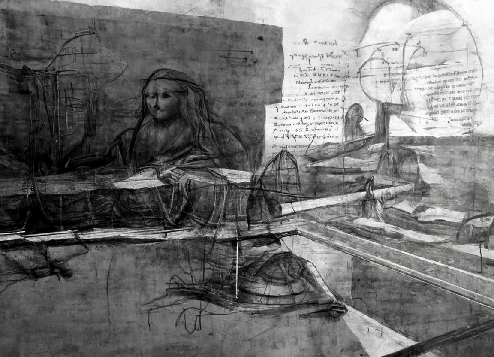
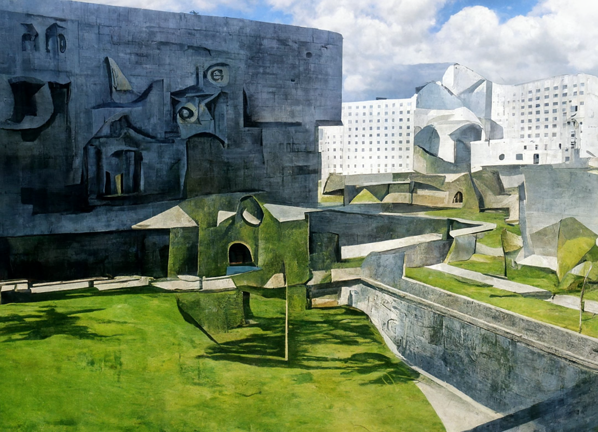
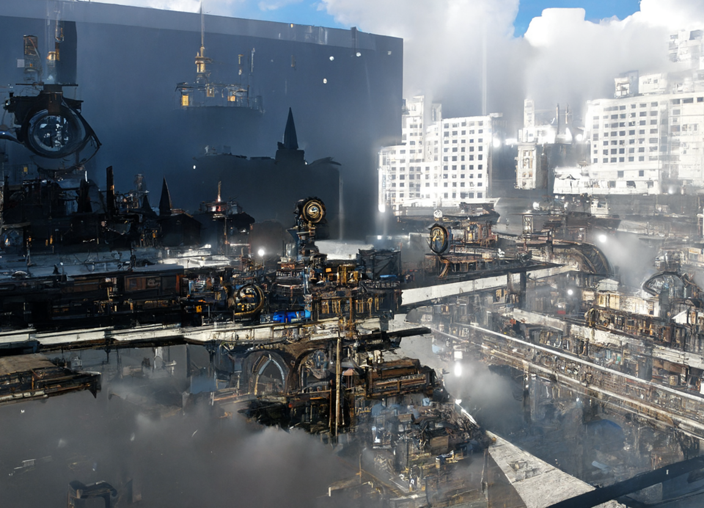
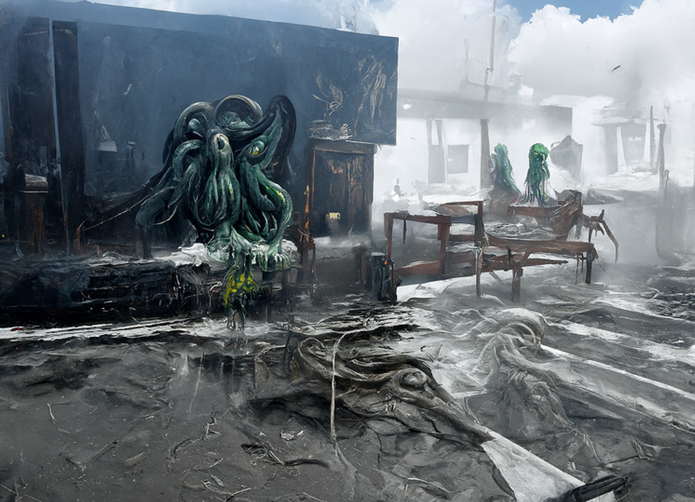
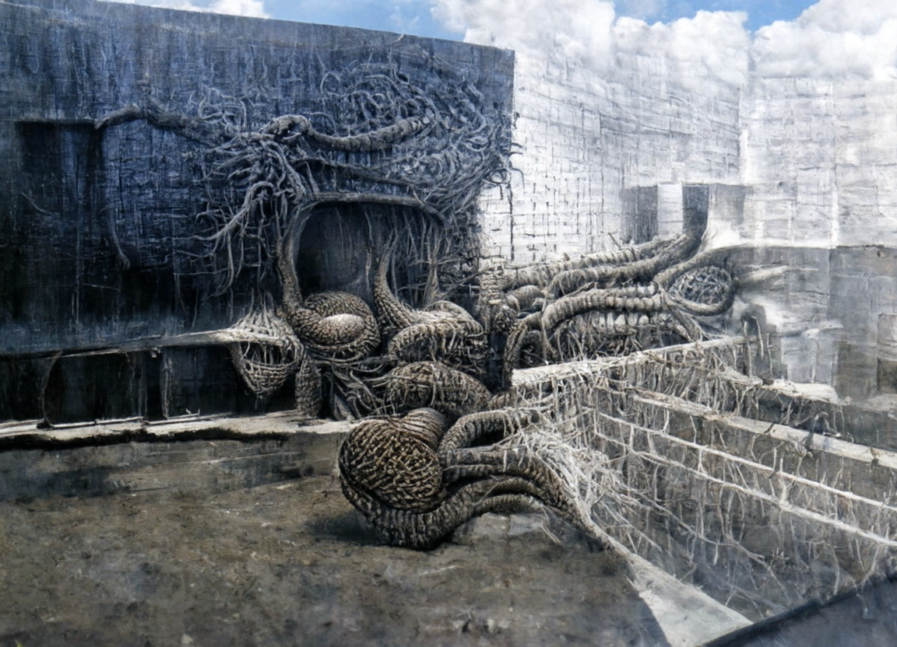

<link rel="stylesheet" href="https://cdn.jsdelivr.net/npm/aplayer@1.7.0/dist/APlayer.min.css">

## About Me

I am a compassionate person who cherishes my family and friends. I enjoy playing video games and watching TV shows on platforms like Netflix and others. The American pop culture has deeply influenced me.

## Dream

I have always had a passion for architecture, and from a young age, my dream was to become an architect. This dream was initially sparked by playing the game ***Minecraft***, where I would design and build everything from medieval castles to Gothic churches. The news of the burning down of Notre-Dame de Paris was a heartbreaking moment for me. I feel deeply connected to the art and beauty of architecture, and in some ways, I consider myself a romantic, someone who is passionate about the majesty of the world around us.

 

    

        <iframe style="position: absolute; width: 100%; height: 100%; left: 0; top: 0;" src="../plugs/photo_album2/index.html" frameborder="0" scrolling="no" id="myIframe"></iframe>
    

  

Displayed above are my architectural creations from Minecraft, all of which I built brick by brick **at the age of 14**. Sadly, due to the passage of time, most of my Minecraft game files have been lost, and these are all the architectural works I could find.

However, when the time came to choose my college major, I discovered that the architecture industry in China was on the decline, and architects often had to work long hours for low salaries. Therefore, I let go of my dream of becoming an architect and chose a major in engineering instead. I decided to study automation engineering, where I gained fundamental knowledge in various fields, including advanced mathematics, computer programming, circuit theory and control theory. This not only expanded my horizons but also enabled me to discover my passion for electronic design automation ***(EDA)***. Currently, I am dedicatedly researching this field, with a goal of pursuing a Ph.D in EDA or computer systems.

## College Life

I had been living in a small town until I came to Shenzhen University (SZU), where I spent four precious years. This international city, Shenzhen, has made a great difference to me. Here, I met a group of lovely people and professors who have been so kind to me. Click [HERE](https://guohaodai.github.io/){: .btn--code} to see how chilled I was! 

SZU has enabled me to construct my own methodology for facing the world and has given me clarity on what I should pursue. If I could go back to the moment of choosing my college major, I think I would still choose SZU.

    
     
    

       Picture of SZU
  	

The above image is my favorite photograph that I captured at SZU. The prominent feature in the foreground is the Department of Mechanics and Control Engineering building. Purely for entertainment and fun, I applied the **Disco Diffusion** model to transform the image into several unique styles, resulting in fascinating outcomes.

    

        

            
             
            

               Origin
            

        

        

            
             
            

               Van Gogh
            

        

        

            
             
            

               Da Vinci's Manuscript
            

        

    

    

        

            
             
            

               Picasso
            

        

        

            
             
            

               Chinese Painting
            

        

        

            
             
            

               Steampunk
            

        

    

        

        

            
             
            

               Cyberpunk
            

        

        

            
             
            

               Cthulhu
            

        

        

            
             
            

               Alien
            

        

    

    

    	    Disco Diffusion
    

<object width="340" height="86" data="http://music.163.com/style/swf/widget.swf?
sid=1805929928&type=2&auto=0&width=320&height=66" 
type="application/x-shockwave-flash"></object>

666

## Musical Obsessions

I love R&B singer *The Weeknd*. I even made a mix-up of 


