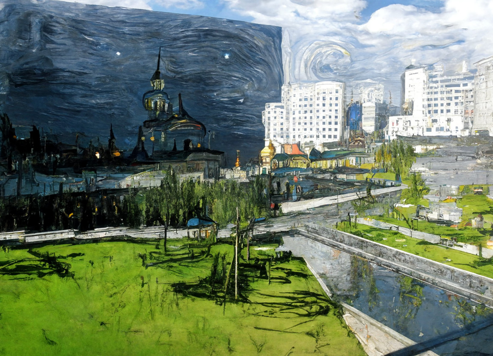
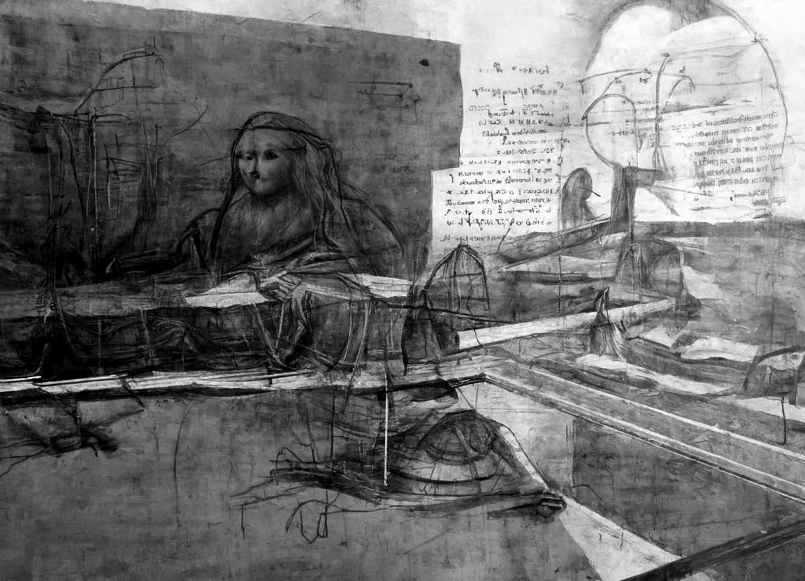
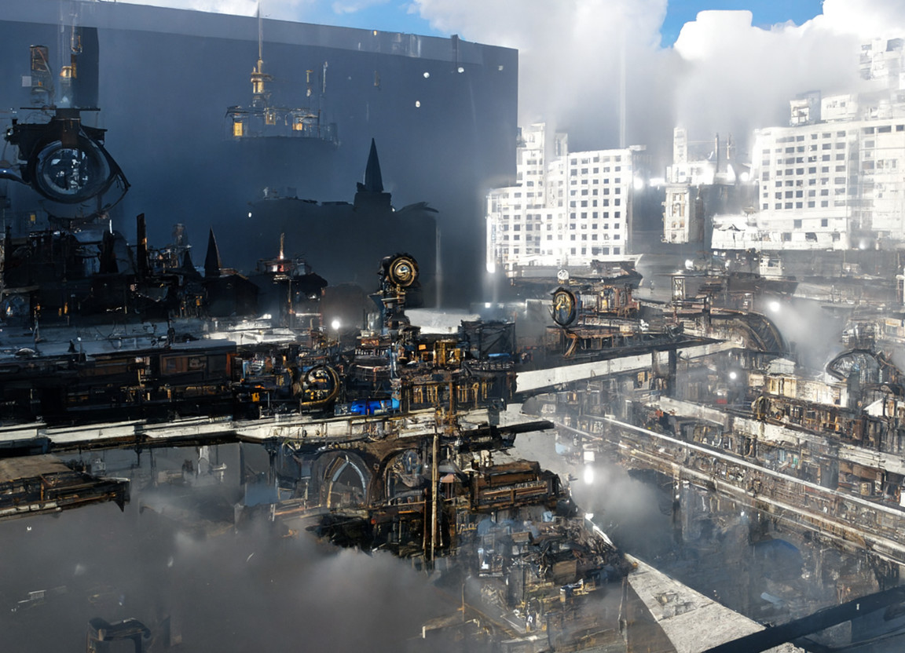
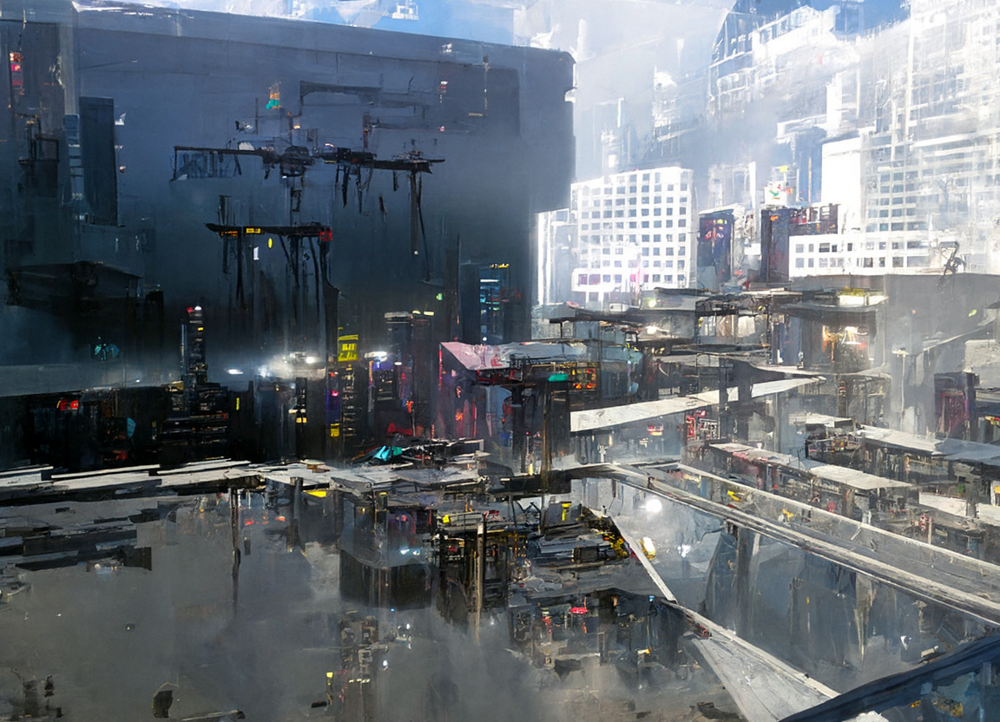
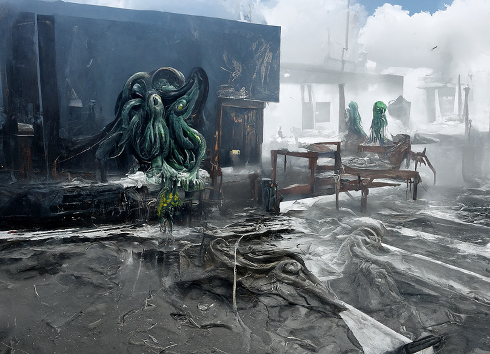

<link rel="stylesheet" href="https://cdn.jsdelivr.net/npm/aplayer@1.7.0/dist/APlayer.min.css">

## About Me

I am a compassionate person who cherishes my family and friends. I enjoy playing video games and watching TV shows on platforms like Netflix and others. 

## Dream

I have always had a passion for architecture, and from a young age, my dream was to become an architect. This dream was initially sparked by playing the game ***Minecraft***, where I would design and build everything from medieval castles to Gothic churches. I feel deeply connected to the art and beauty of architecture, and in some ways, I consider myself a romantic, someone who is passionate about the majesty of the world around us. So the news of the burning down of Notre-Dame de Paris was really a heartbreaking moment for me, as it is a true masterpiece and symbol of human achievement.

 

    

        <iframe style="position: absolute; width: 100%; height: 100%; left: 0; top: 0;" src="../plugs/photo_album2/index.html" frameborder="0" scrolling="no" id="myIframe"></iframe>
    

    

        My crafted designs in Minecraft
    

  

Displayed above are my architectural creations from Minecraft, all of which I built brick by brick **at the age of 14**. Sadly, due to the passage of time, most of my Minecraft game files have been lost, and these are all the architectural works I could find.

However, when the time came to choose my college major, I discovered that the architecture industry in China was on the decline, and architects often had to work long hours for low salaries. Therefore, I let go of my dream of becoming an architect and chose a major in engineering instead. I decided to study automation engineering, where I gained fundamental knowledge in various fields, including advanced mathematics, computer programming, circuit theory and control theory. This not only expanded my horizons but also enabled me to discover my passion for electronic design automation ***(EDA)***. Currently, I am dedicatedly researching this field, with a goal of pursuing a Ph.D in EDA or computer systems.

## Campus Life

I had been living in a small town until I came to Shenzhen University (SZU), where I spent four precious years. This international city, Shenzhen, has made a great difference to me. Here, I met a group of lovely friends and professors who have been so kind to me. Click [HERE](https://guohaodai.github.io/szu_life_imgs/){: .btn--code} to see how chilled out I was! 

SZU has enabled me to construct my own methodology for facing the world and has given me clarity on what I should pursue. If I could go back to the moment of choosing my college, I think I would still choose SZU.

    
     
    

       Picture of SZU
  	

The above image is my favorite photograph that I captured at SZU. The prominent feature in the foreground is the Department of Mechanics and Control Engineering building. Purely for entertainment and fun, I applied the **Disco Diffusion** model to transform the image into several unique styles, resulting in fascinating outcomes.

    

        

            
             
            

               Origin
            

        

        

            
             
            

               Van Gogh
            

        

        

            
             
            

               Da Vinci's Manuscript
            

        

    

    

        

            
             
            

               Picasso
            

        

        

            
             
            

               Chinese Painting
            

        

        

            
             
            

               Steampunk
            

        

    

        

        

            
             
            

               Cyberpunk
            

        

        

            
             
            

               Cthulhu
            

        

        

            
             
            

               Alien
            

        

    

    

    	    Disco Diffusion Outputs
    

## Musical Obsessions

Ever since 2015, I have been a huge fan of *The Weeknd*, a Canadian R&B singer. What drew me to his music was the way he explores dark, explicit and conflicting themes, exposing me to a new cultural perspective. His unique and magnetic vocals always seem to resonate with me on a deeper emotional level.

Back in 2017, as a tribute to his talent, I created a mash-up audio featuring some of my favorite *Weeknd* tracks.

    

        <iframe frameborder="no" border="0" style="width:60%; padding-bottom:0px; margin-bottom:0px;" marginwidth="0" marginheight="0" width=50 height=85 src="//music.163.com/outchain/player?type=3&id=2521845920&auto=0&height=66"></iframe>
         
        

            My mash-up audio of The Weeknd
        

    

I also created a music video for one of *The Weeknd*'s singles by compiling different video footage and imagery to complement the song and create a visual experience that resonates with its mood and tone.	

    

    <iframe src="//player.bilibili.com/player.html?aid=19643843&bvid=BV15W411J7GF&cid=32031366&page=1&autoplay=0" scrolling="no" border="0" frameborder="no" framespacing="1" allowfullscreen="false" 
    style="width:80%; aspect-ratio: 1 / 0.65"> </iframe>   
    

            My Weeknd Mashup: A Visual Mixtape
    

    

Out of all his songs, my favorite has to be "As You Are". The smooth and soulful melody, combined with his signature vocal delivery, always leaves me feeling a sense of melancholic nostalgia.

    

    

        My favourite track, The Weeknd - As you are
    

The Weeknd has truly made an indelible impact on the music industry, and I can't wait to see what he has in store for us next.
